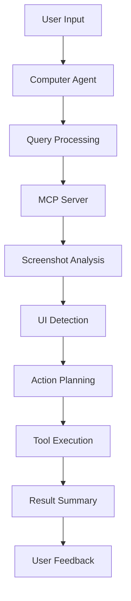

# 🤖 Computer Agent - EAG Assignemnt 13

A sophisticated AI-powered computer automation agent that can interact with desktop applications through natural language commands. Built with Google's Gemini AI and designed to perform complex computer tasks including application control, text formatting, and document manipulation.

## 🎯 Features

- **Natural Language Interface**: Communicate with your computer using plain English
- **Application Automation**: Control Microsoft Word, Notepad, and other desktop applications
- **Text Formatting**: Apply bold, italic, underline formatting through voice commands
- **Interactive Sessions**: Continuous conversation mode with session management
- **Error Handling**: Robust error recovery and logging system
- **MCP Integration**: Uses Model Context Protocol for advanced computer control

## 🏗️ Architecture

### Core Components

#### 1. Main Entry Point (`windowcontrol.py`)
- Interactive command-line interface
- Session management and conversation flow
- Environment variable handling
- Agent lifecycle management

#### 2. Computer Agent (`agent/agent.py`)
- Core AI agent powered by Google Gemini
- Natural language processing and understanding
- Task decomposition and execution planning
- Integration with MCP server for computer control

#### 3. MCP Server Integration (`agent/mcp/`)
- Model Context Protocol implementation
- Computer vision and UI element detection
- Mouse and keyboard automation
- Window management and application control

#### 4. Pipeline Processing (`pipeline/`)
- Screenshot capture and analysis
- OCR text recognition
- YOLO object detection
- UI element identification and grouping

### Execution Flow



## 🚀 Quick Start

### Prerequisites

- Python 3.11+
- Windows OS
- Google Gemini API Key
- Microsoft Word (for document formatting tasks)

### Installation

1. **Clone the repository**
```bash
git clone <your-repo-url>
cd assignment13
```

2. **Install dependencies**
```bash
pip install -r requirements.txt
# or if using uv
uv sync
```

3. **Set up environment variables**
Create a `.env` file in the project root:
```env
GEMINI_API_KEY=your_gemini_api_key_here
```

4. **Run the agent**
```bash
python windowcontrol.py
# or with uv
uv run windowcontrol.py
```

## 💡 Usage Examples

### Basic Commands

**Open Applications:**
```
Open Microsoft Word
```

**Text Formatting:**
```
Click on the Bold button in Microsoft Word Home tab
```

**Document Creation:**
```
Open Microsoft Word, apply bold italic and underline formatting, then write a poem about nature
```

**Keyboard Shortcuts:**
```
In Microsoft Word, use Control+B for bold, Control+I for italic, Control+U for underline, then type a poem
```

### Step-by-Step Approach

For complex formatting tasks, break them down:

1. `"Open Microsoft Word"`
2. `"Click on the Bold button in the formatting toolbar"`
3. `"Click on the Italic button"`
4. `"Click on the Underline button"`
5. `"Type a poem about your favorite season"`

## 📁 Project Structure

```
assignment13/
├── windowcontrol.py          # Main entry point
├── main.py                   # Alternative entry point
├── pyproject.toml           # Project configuration
├── uv.lock                  # Dependency lock file
├── .env                     # Environment variables
├── agent/                   # Core agent implementation
│   ├── __init__.py
│   ├── agent.py            # Main ComputerAgent class
│   ├── core/               # Core agent logic
│   │   ├── context.py      # Session context management
│   │   ├── decision.py     # Decision making engine
│   │   ├── execution.py    # Tool execution handler
│   │   ├── loop.py         # Main agent loop
│   │   ├── perception.py   # Screen analysis
│   │   └── summary.py      # Session summarization
│   ├── mcp/                # MCP server integration
│   │   └── comp_mcp.py     # Computer control MCP
│   ├── models/             # AI models and mode management
│   ├── prompts/            # AI prompts and templates
│   └── utils/              # Utility functions
├── config/                 # Configuration files
│   ├── log_config.py       # Logging configuration
│   └── mcp_server_config.yaml
├── pipeline/               # Image processing pipeline
│   ├── pipeline.py         # Main pipeline orchestrator
│   ├── screenshot.py       # Screenshot capture
│   └── pipeline_utils.py   # Pipeline utilities
├── utils/                  # General utilities
│   ├── ocr_detector.py     # OCR text recognition
│   ├── yolo_detector.py    # Object detection
│   ├── gemini_analyzer.py  # Gemini AI analysis
│   └── beautiful_visualizer.py # Result visualization
├── logs/                   # Application logs
├── outputs/                # Session outputs and summaries
└── models/                 # AI model files
```

## 📊 Output Structure

Each session generates detailed outputs:

```
outputs/
└── 2025/
    └── 07/
        └── 12/
            └── session_20250712_143022/
                ├── step_1/
                │   ├── screenshot_*.jpg
                │   └── pipeline_output.json
                ├── step_2/
                │   ├── screenshot_*.jpg
                │   └── pipeline_output.json
                └── session_summary.json
```

### Session Data

- **Screenshots**: Visual record of each step
- **Pipeline Analysis**: Detailed UI element detection
- **Session Summary**: Complete task execution history
- **Error Logs**: Debugging information for failed operations

## ⚙️ Configuration

### Agent Settings

The agent can be configured through various parameters:

```python
# In agent/core/loop.py
max_steps = 10      # Maximum steps per session
max_retries = 3     # Maximum retries per step
```

### Logging Configuration

Logging is configured in `config/log_config.py`:
- Debug level logging for development
- File-based logging for session tracking
- Console output for real-time feedback

## 🔧 Troubleshooting

### Common Issues

**Keyboard Shortcuts Not Working:**
- Try using individual button clicks instead of keyboard combinations
- Use step-by-step approach for complex formatting
- Check if the application has focus

**Agent Not Responding:**
- Verify Gemini API key is set correctly
- Check internet connection
- Review logs for detailed error information

**Application Detection Issues:**
- Ensure the target application is visible on screen
- Try maximizing the application window
- Use specific application names in commands

## 🤝 Contributing

Contributions are welcome! Please follow these steps:

1. Fork the repository
2. Create a feature branch (`git checkout -b feature/amazing-feature`)
3. Commit your changes (`git commit -m 'Add amazing feature'`)
4. Push to the branch (`git push origin feature/amazing-feature`)
5. Open a Pull Request

## 📄 License

This project is licensed under the MIT License - see the LICENSE file for details.

## 🙏 Acknowledgments

This project integrates several advanced technologies:

1. **Google Gemini AI**
   - Natural language processing and understanding
   - Computer vision and screen analysis
   - Decision making and task planning

2. **Model Context Protocol (MCP)**
   - Standardized computer control interface
   - Tool execution and automation
   - Cross-platform compatibility

3. **Computer Vision Pipeline**
   - YOLO object detection
   - OCR text recognition
   - UI element analysis and grouping

## 📞 Support

For questions, issues, or contributions:
- **Issues**: Create an issue in the repository
- **Documentation**: This README and inline code comments
- **Logs**: Check `logs/common.log` for debugging information

---

**🚀 Ready to automate your computer tasks with AI! Happy coding!**
